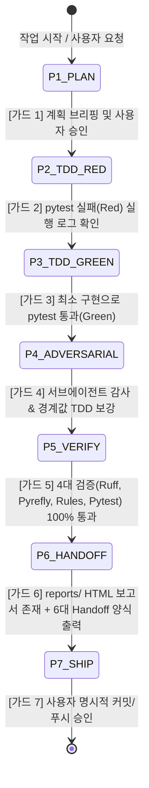

# AGENT_WORKFLOW.md

> AI 에이전트 작업 워크플로우 및 프로세스 가이드입니다.  
> 세션 인계, 보고서 생성, 프로세스 규칙 등 상세 절차가 필요할 때 참고합니다.

---

## 0. 협업 라이프사이클 7단계 상태 머신 (Phase 1 ~ Phase 7)

에이전트는 모든 이슈·기능 구현 시 임의로 단계를 건너뛰지 않고 아래 P1~P7 상태 머신을 순차적으로 전이한다:



| Phase | 단계명 | 진입 및 완료 가드 (Transition Guard) | 핵심 산출물 |
| :--- | :--- | :--- | :--- |
| **P1** | **Plan & Briefing** | 사용자 요구 분석 ➔ 기술적 답변 및 작업 계획·TDD 시나리오 브리핑 ➔ 사용자 승인 | 계획 브리핑 |
| **P2** | **TDD Red** | 프로덕션 수정 전 실패하는 테스트 작성 ➔ `pytest` 실패(Red) 실행 로그 기계 확인 | 실패 테스트 |
| **P3** | **TDD Green** | 최소 프로덕션 코드 구현 ➔ 해당 테스트 통과(Green) | 통과 코드 |
| **P4** | **Adversarial Audit** | **에이전트 자발적 서브에이전트 가동** ➔ 엣지 케이스 감사 ➔ 경계값 TDD 보강 | 감사 리포트 & 보강 테스트 |
| **P5** | **4대 기계 검증** | `ruff`, `pyrefly`, `check_rules.py`, `pytest` 전수 실행 ➔ 0 error 통과 | 4대 검증 로그 |
| **P6** | **Handoff & Report** | 아키텍처 변경 시 `reports/*.html` 생성 ➔ `AGENT_WORKFLOW.md` §3 6대 Handoff 양식 출력 | HTML 보고서, Handoff |
| **P7** | **Ship** | 사용자 최종 승인 ➔ Git 커밋, 데스크톱 동기화(`desktop-sync`), 푸시/PR | Git 커밋 & PR |

- 기계 검증 가드: `tools/check_workflow.py`를 실행하여 현재 단계의 필수 산출물과 검증 요건을 기계적으로 확인한다.

---

## 1. 사용자 질의·코멘트 우선 응답 및 진행 방안 사전 승인 원칙 [P1 가드]

사용자가 질문이나 피드백, 코멘트를 제시한 경우 임의로 다음 단계 명령(git push, 브랜치 전환, 코드 수정 등)을 앞서서 독단적으로 실행해서는 안 되며, 반드시 아래 3단계를 거쳐야 합니다:

1. **우선 명확한 답변 제공**:
   - 사용자의 질문이나 의문에 대해 기술적 배경, 아키텍처 원리, 타 도구 벤치마크 결과 등을 먼저 쉽고 명확하게 설명합니다.
2. **피드백을 반영한 진행 방안 및 작업 계획 제시**:
   - 사용자 코멘트가 반영된 구체적인 변경 사항, 해결책, 다음 단계 순서를 일목요연하게 정리하여 공유합니다.
3. **사용자 사전 검토 및 명시적 승인 후 착수**:
   - 제시한 답변과 진행 계획에 대해 사용자의 피드백 및 명시적인 진행 승인을 받은 후에만 후속 작업(커밋, 푸시, 브랜치 이동, PR 코멘트 등록 등)을 실행합니다.

---

## 2. 엄격한 TDD 및 적대적 검증 (Adversarial Validation) 프로세스

`AGENTS.md` §6의 테스트 규칙과 더불어, 복잡한 동시성·상태 머신·워커 수명주기 작업 시 아래 검증 프로세스를 준수합니다:

1. **실패 테스트 선행 (Red-Green-Refactor)**:
   - 기능 추가나 결함 수정 시, 실제 코드를 건드리기 전에 **재현 실패하는 테스트**를 먼저 작성하고 실행하여 실패(Red)를 확인한 후 구현(Green)에 착수합니다.
2. **음성 단언(Negative Assertion) 필수화**:
   - 정리/삭제 테스트는 "지워야 할 파일이 삭제됨"뿐만 아니라, **"지우면 안 되는 이웃 파일(`S (1).mp4` 등)이 온전히 남아 있음"**을 반드시 함께 단언합니다.
3. **무맥락 적대적 검증 (Adversarial Review)**:
   - 동시성, 상태 머신, 백그라운드 워커 수정 후에는 **`docs/AI_ADVERSARIAL_VALIDATOR_GUIDE.md`**의 A~L 체크리스트(동시성 원자성, UI 넌블로킹, 테스트 무결성, 리소스 수명 등)를 바탕으로 엣지 케이스 및 레이스 컨디션을 자체 검증하거나 서브에이전트 감사를 수행합니다.

---

## 3. 세션 인계 정보 (Handoff) 표준 출력 양식

세션 종료 또는 작업 완료 시, 추측이 아닌 `git status / diff` 기반의 결정적 사실만 아래 포맷으로 출력합니다:

```markdown
## 세션 인계 정보 (Handoff)

### 1. 이번 세션에서 변경된 파일 (`git status --porcelain` 기준)
- ...

### 2. 파일별 변경 요약
- path/to/file.py: 한 줄 요약

### 3. 검증 상태 (실제 실행 결과)
- ruff / pyrefly / pytest 통과 결과

### 4. 미해결·이월 항목 및 다음 세션 착수 파일
- ...

### 5. 아키텍처 학습용 HTML 분석 보고서 (`explain-diff-html`)
- 보고서 링크: [`file:///c:/path/to/reports/YYYY-MM-DD-explanation-<slug>.html`](file:///c:/path/to/reports/YYYY-MM-DD-explanation-<slug>.html)
- 핵심 설계 결정 & 트레이드오프: (채택된 설계와 기각된 대안 요약 1~2줄)
*(유의미한 아키텍처/설계 변경이 없는 자잘한 수정 세션의 경우 "해당 없음" 기재)*

### 6. 스킬 및 자동화 제안 (Skill & Automation Candidates)
- **추천 스킬/도구명**: (예: `vod-error-diagnose`, `quick-verify` 등 또는 "해당 없음")
- **제안 이유**: (이번 작업 중 복잡했거나 반복될 절차, 비전문가 사용자 관점에서의 기대 효과)
- **구성 내용**: (매뉴얼 제목, 한 줄 설명, 스킬 호출 시 AI가 대신 수행할 핵심 절차 요약)
```

---

## 4. 설계 결정 및 트레이드오프 학습용 HTML 보고서 생성 규칙 (`explain-diff-html`) [필수]

본 프로젝트는 코드의 기계적 변경 나열이 아닌, **시스템 설계적 결정과 아키텍처 트레이드오프의 깊이 있는 학습**을 중시합니다.  
신규 기능 도입, 동시성/상태 머신 제어, 비동기 수명주기 설계, 대규모 리팩터링 등 **학습 가치가 있는 유의미한 아키텍처 변경 작업**이 완료되면, 세션 인계 전 반드시 `explain-diff-html` 스킬을 사용하여 대화형 HTML 보고서를 생성해야 합니다.

1. **발동 및 제외 기준 (Filtering)**:
   - **발동 (필수)**: 슬롯 동시성, 비동기 워커 수명주기, 상태 전이 원자성, 신규 엔진 레이어 추가 등 설계적 고민과 트레이드오프가 수반된 작업.
   - **제외 (스킵)**: 단순 오타/주석 교정, UI 라벨/문구 변경, 린트/포맷 단독 적용, 단일 단순 유닛 테스트 보완 등.

2. **보고서 서술 철학 & 4대 핵심 섹션**:
   - **서술 스타일**: Martin Kleppmann 스타일의 명료하고 서사적인 문체. 기술적 본질에 집중하며 ASCII 아트 금지(심플한 HTML/CSS 다이어그램 사용).
   - **Background**: 시스템 아키텍처 맥락 (초보자를 위한 시스템 원리 + 본 변경과의 연관 배경).
   - **Intuition**: 설계의 핵심 직관. **왜 이 설계를 선택했고, 대안은 왜 배제되었는지(트레이드오프)**를 토이 데이터와 시각적 다이어그램으로 설명.
   - **Code**: 줄 단위가 아닌 아키텍처 단위로 묶은 고차원 코드 워크스루 (`<pre>` 태그 및 `white-space: pre-wrap` 필수).
   - **Quiz**: 독자가 변경의 실질적인 메커니즘과 트레이드오프를 체득했는지 검증하는 대화형 객관식 5문항 (클릭 시 정답/해설 제공).

3. **저장 위치 및 Git 트래킹 차단 원칙**:
   - **저장 디렉터리**: 현재 프로젝트 루트의 `reports/` 폴더에 저장합니다 (디렉터리가 없으면 자동 생성).
   - **파일명 규격**: `reports/YYYY-MM-DD-explanation-<slug>.html` (날짜 기반 정렬).
   - **Git 트래킹 차단**: `.gitignore`에 `reports/`가 등록되어 있으므로 Git status/commit을 일절 오염시키지 않습니다.

4. **세션 인계 연동**:
   - 생성 완료 후 세션 인계 정보 5번에 로컬 브라우저 오픈용 `file:///` 링크를 첨부하여 사용자가 즉시 학습할 수 있도록 제출합니다.

---

## 5. 스킬 및 단축 워크플로우 자발적 제안 규칙 [필수]

에이전트는 사용자가 비전문가임을 항상 인지하고, 세션 종료 시 본 세션에서 수행한 작업 중 '스킬(Skill)'이나 '단축 명령(Makefile/단축 스크립트)'으로 체계화할 가치가 있는 항목을 적극적으로 발굴하여 제안해야 합니다:

1. **발굴 기준**:
   - **다단계 복잡 절차**: 3단계 이상의 순차 명령이나 검증이 필요했던 작업 (예: 특정 UI/엔진 상태 동기화, UI 피드백 카탈로그 5단계 동기화 등).
   - **명령어 실수 방지**: 파라미터가 길어 AI가 명령을 지어내다 오타/실수를 유발하기 쉬운 명령 조합 (예: `uv run --no-sync ...` 일괄 검사 등).
   - **정형화된 재발 작업**: 다음 개발 스프린트나 버그 픽스 시 동일하게 다시 발생할 가능성이 높은 작업 절차.
2. **비전문가 친화적 설명 원칙**:
   - 난해한 기술 용어 대신, **"이 스킬을 만들어 두면 앞으로 어떤 상황에서 편리한지"**, **"AI가 무엇을 대신해 주는지"** 비전문가 눈높이의 쉬운 언어로 설명합니다.
3. **실행 연결**:
   - 사용자가 "그거 스킬로 만들어줘"라고 승인하면, 즉시 `.agents/skills/<name>/SKILL.md` (또는 전역 경로)에 표준 형식으로 구조화하여 등록합니다.
